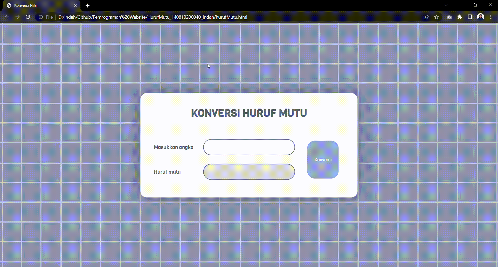

# Konversi-Huruf-Mutu

Proyek ini memungkinkan pengguna untuk mengkonversi nilai angka menjadi huruf mutu sesuai dengan skala yang ditentukan. Pengguna dapat memasukkan nilai angka dan melihat hasil konversi huruf mutu yang sesuai. Berikut skala nilainya:
- 81 - 100 : A
- 71 - 80 : AB
- 66 - 70 : B
- 61 - 65 : BC
- 56 - 60 :C
- 41 - 55 : D
- 0 - 40 : E

## Tools yang Digunakan

- HTML: Untuk struktur dan konten halaman web.
- CSS: Untuk mengatur tampilan dan gaya halaman web.
- JavaScript: Untuk logika tampilan dan interaksi.

## Pratinjau

_*background image : Pinterest_

## Cara Penggunaan

1. Buka file `hurufMutu.html`.

2. Anda akan melihat antarmuka konversi huruf mutu yang terdiri dari box input nilai angka, tombol "Konversi", dan box output huruf mutu.

3. Masukkan nilai angka yang ingin Anda konversi ke dalam kotak input.

4. Error Handling akan muncul jika pengguna mememberikan input selain angka 1-100.

5. Klik tombol "Konversi" untuk melihat hasil konversi huruf mutu.

6. Hasil konversi huruf mutu akan ditampilkan pada box "Huruf Mutu".

## Struktur Proyek

- `hurufMutu.html`: Berisi struktur HTML dan antarmuka konversi huruf mutu.
- `style.css`: Berisi gaya dan tata letak konversi huruf mutu menggunakan CSS.
- `script.js`: Berisi logika konversi huruf mutu menggunakan JavaScript.
